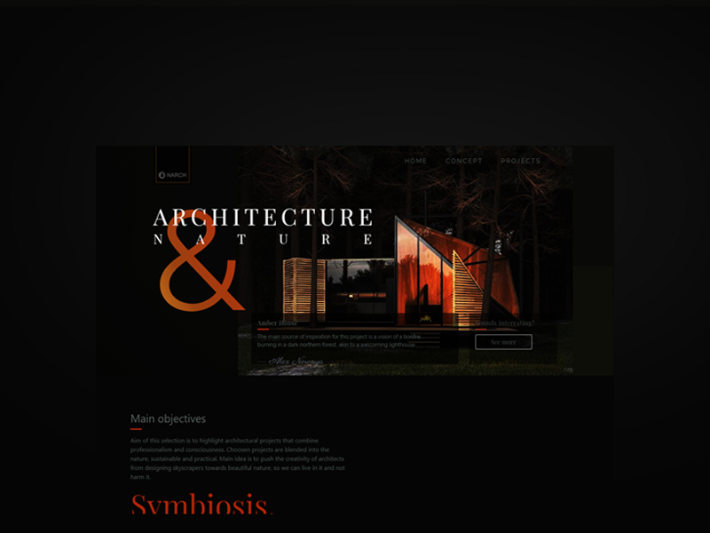

# Bootstrap website

This website was my own challenge. I wanted to know how much bootstrap helps me in scripting since I consider basic bootstrap pages boring in terms of development.
I googled some CDN's to add some smooth movement and make this website more alive, so I revealed https://scrollrevealjs.org/ .

In this website I wanted to show my admiration to a certain architectural projects instead of designing a page with products that already exist.
Website is short and practical, since I think of complex websites as an early 2000's story.

* Project name: __Bootstrap website__
* Project technologies: __HTML, CSS, Bootstrap, Javascript__
* Project status: __not finished__
* Devices: __mobile, tablet, desktop__

by Elma Mehmedić
